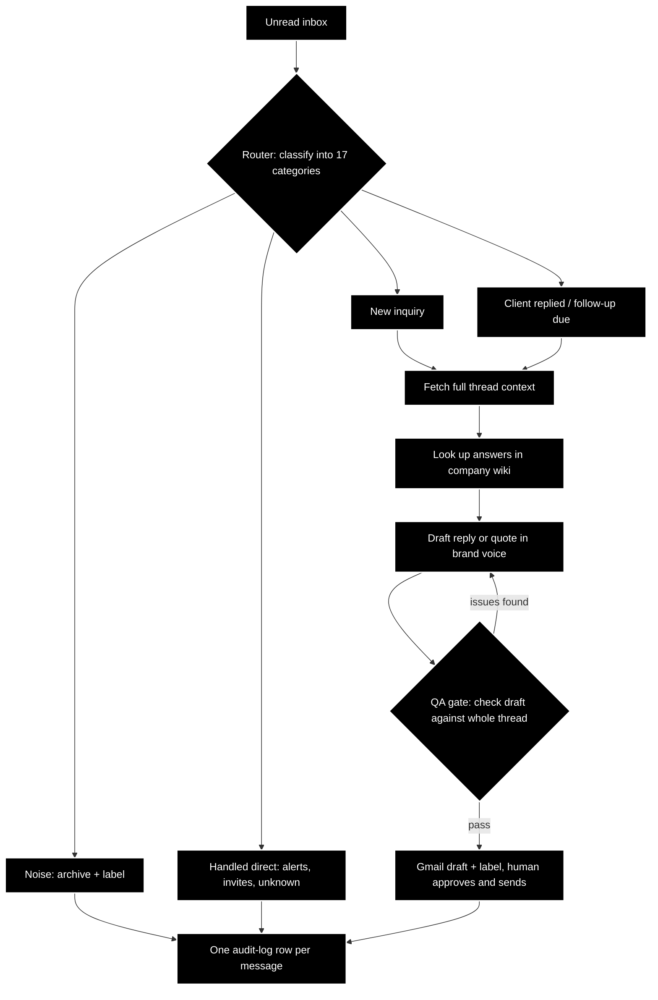
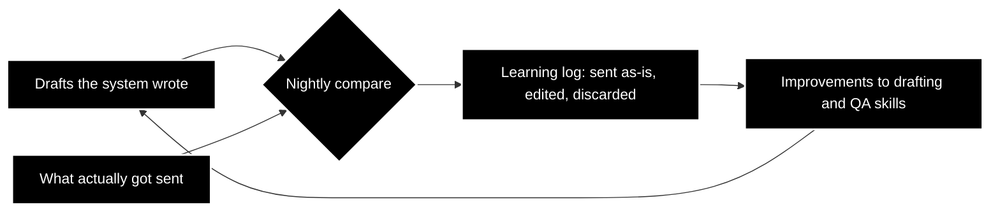

# AI Email Workflow

An AI workflow that runs my tour company's inbox. Shipped and running daily. Three times a day it triages every unread message, drafts personalized replies and quotes from the company knowledge base, and leaves them for a human to approve and send. It never sends on its own.

The code is private because it's wired into the live business inbox. This repo is the build log, with diagrams instead of screenshots since the interesting part is the wiring.

## The flow

A router classifies each unread message into one of 17 categories (new inquiry, client replied, follow-up due, partner platform, noise, security alert, and so on) and dispatches the right handler. Handlers are chains of small single-purpose skills, so each piece can be tested, reused, and improved on its own.

## The QA gate

Every draft is checked against the entire thread history before it's saved: missed client questions, contradictions with earlier promises, price or date mismatches, unfilled template placeholders, banned phrases, and whether the sign-off matches the product being sold. If the gate finds issues, it sends the draft back to the drafter with a structured correction list, up to two rounds, then escalates to a human with the full diagnostic chain instead of shipping something wrong.

## The learning loop

The part I'm proudest of. Every night, a separate job compares the drafts the system wrote over the past month against what actually got sent from the Sent folder. Every human edit is a lesson, and the diffs get written to a learning log that feeds improvements back into the drafting and checking skills. The system improves the more it's used, using the most honest signal there is: what a human changed before hitting send.

## Follow-up cadence

Inquiries that go quiet get a polite nudge at day 3 (A/B tested between two templates) and a courteous close-out at day 10. Long-horizon prospects can opt out of that cadence into a monthly check-in instead. All drafted, never auto-sent.

## Reliability, the hard-won part

This system taught me more about production AI than anything else I've built:

- **A dedup guard** marks every processed message so a crashed run can't double-draft.
- **One logging skill** is the only thing allowed to write the audit log: one canonical row per message, listing every skill that touched it. When five different skills all write their own logs, you have no log.
- **Small skills chain; big skills rot.** The first version was three monolithic scripts with duplicated logic. The refactor into single-purpose skills (thread fetch, wiki lookup, draft, QA, Gmail actions, logging) is what made the system debuggable and improvable.
- **Headless is different.** A skill that works in a chat session fails quietly on a schedule. Big documents get parsed by scripts, not read into context; every run leaves an auditable trail.

## Plumbing

Headless Claude Code fired on a schedule (launchd, three times a day), Gmail through a CLI, the company wiki as the knowledge base for products, pricing, policies, and templates, and proposal PDFs attached from Drive. Runs unattended on a Mac.

## Build log

- **2026-07**: Learning loop hardened: the nightly postmortem now parses the full run history by script instead of reading it into context, which fixed silent truncation on large logs.
- **2026-05**: The big refactor: monolithic handlers split into chained single-purpose skills, with one canonical logging skill and per-message audit rows.
- **Earlier**: First version shipped: router, inquiry drafting from wiki templates, follow-up cadence, noise handling.
